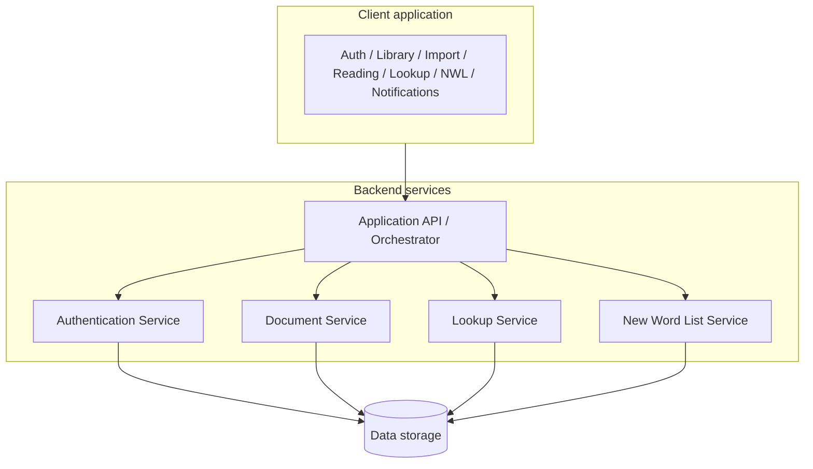

# Read Chinese With Sino-Vietnamese - High-Level Design (MVP)

## 1) Purpose and Scope

High-level system design for MVP, focusing on component boundaries and interactions.

## 2) System Context

Primary user: Vietnamese learner reading Chinese text with instant lexical support.

Core capability chain:

1. Authenticate user.
2. Access reading workspace.
3. Import new document or open existing document.
4. Select text and trigger lookup.
5. Review lexical results.
6. Save useful entries into New Word List.

## 3) High-Level Components

## 3.1 Client Application (UI Layer)

Responsible for user-facing flows and interaction state.

Sub-components:

- `Auth UI`: login screen, session-aware routing.
- `Library UI`: list existing documents and actions (`Import`, `Open`).
- `Import UI`: file picker/drag-drop and import feedback.
- `Reading Workspace UI`: render document content for reading.
- `Selection/Lookup Trigger UI`: double-click handling, `Look up` button; yellow highlight only after user clicks `Look up`.
- `Lookup Result Panel UI`: display lexical fields and loading/error/no-result states.
- `New Word List UI`: view saved entries and remove items.
- `Notification UI`: actionable success/error messages.

## 3.2 Application API / Orchestrator (Service Layer)

Single backend entry point for authenticated app operations.

Responsibilities:

- session/token validation.
- user-scoped authorization checks.
- route requests to document, lookup, and vocabulary services.
- normalize API responses for client consistency.

## 3.3 Authentication Service

Handles username/password login and session lifecycle.

Responsibilities:

- verify credentials securely.
- issue and validate sessions/tokens.
- handle session expiry and re-authentication.

## 3.4 Document Service

Manages document ingestion and retrieval for reading.

Responsibilities:

- import supported formats (`EPUB`, `TXT`, `HTML`).
- validate file type/content and return actionable import errors.
- parse and store text in a renderable internal format.
- return user document list (existing documents).
- return document content by document id (open existing flow).

## 3.5 Lookup Service (Lexical Aggregation)

Resolves selected Chinese text into lexical information.

Responsibilities:

- receive selected text and optional context.
- query source stack for required fields:
  - Chinese definition
  - pinyin
  - Han Viet
  - Vietnamese definition
- return normalized lookup result with explicit missing-field labels.
- optionally use cache for repeat lookups.

## 3.6 New Word List Service

Manages persistent vocabulary collection for each user.

Responsibilities:

- add entry from lookup result.
- enforce duplicate policy on add only.
- retrieve and remove saved entries.

## 3.7 Data Storage Layer

Persistent storage for app entities.

Logical stores:

- user and authentication/session data.
- imported document metadata and content.
- lookup cache (optional but recommended for responsiveness).
- New Word List entries.

Lookup may use storage mainly for optional cache; document and vocabulary data always persist per user.

## 4) Core Data Entities

- `LookupResult`
  - `text`
  - `chineseDefinition`
  - `pinyin`
  - `hanViet`
  - `vietnameseDefinition`
- `NewWordListItem`
  - `id`
  - `text`
  - `chineseDefinition`
  - `pinyin`
  - `hanViet`
  - `vietnameseDefinition`
  - `createdAt`
- `Document` (high-level)
  - `id`
  - `ownerUserId`
  - `title`
  - `sourceFormat` (`EPUB` | `TXT` | `HTML`)
  - `contentRef` (or normalized content payload)
  - `createdAt`
  - `updatedAt`

`LookupResult` is transient in the lookup flow; a saved row is a `NewWordListItem` shaped like the contract (plus `id`, `createdAt`).

## 5) Primary Interaction Flows

## 5.1 Import New Document Flow

1. User logs in.
2. In `Library UI`, user chooses `Import`.
3. `Import UI` sends file to `Application API`.
4. API calls `Document Service` for validation + parsing.
5. `Document Service` stores document and returns `documentId`.
6. UI shows success notification and navigates to `Reading Workspace` for the new document.
7. User reads, selects text, clicks `Look up`, views results, and may add to New Word List.

## 5.2 Open Existing Document Flow

1. User logs in.
2. In `Library UI`, user sees existing documents (fetched via API from `Document Service`).
3. User chooses one document and clicks `Open`.
4. `Reading Workspace UI` requests content by `documentId`.
5. API fetches from `Document Service` and returns renderable content.
6. User reads, selects text, clicks `Look up`, views results, and may add to New Word List.

## 5.3 Lookup Execution Flow

1. User double-clicks a word/phrase in `Reading Workspace`.
2. Client creates selection and shows `Look up`.
3. User clicks `Look up`. Client applies yellow highlight to the selected text and sends it to the API.
4. API calls `Lookup Service`.
5. `Lookup Service` resolves lexical fields and returns normalized `LookupResult`.
6. UI renders required fields (or explicit `Not available` labels).

## 5.4 Add to New Word List Flow

1. User clicks `Add to New Word List` in result panel.
2. API calls `New Word List Service` with lookup payload.
3. Service applies duplicate policy (`text` + normalized reading) for add operation.
4. On duplicate: keep original and return `already in list` response.
5. On success: persist entry and return created item.
6. UI shows clear notification and updated list state.

## 6) Cross-Cutting Concerns

- `Error handling`: all failures return user-actionable messages; lookup errors never crash reading view.
- `Localization/text fidelity`: preserve Chinese Unicode, pinyin tone marks, and Vietnamese diacritics.
- `Security`: secure credential handling, secure transport for networked auth, user data isolation by account.
- `Performance`: immediate UI response on selection and `Look up` button visibility; yellow highlight on `Look up` click; loading states for uncached lookup.
- `Observability` (optional in MVP): basic request/error logging without sensitive data leakage.

